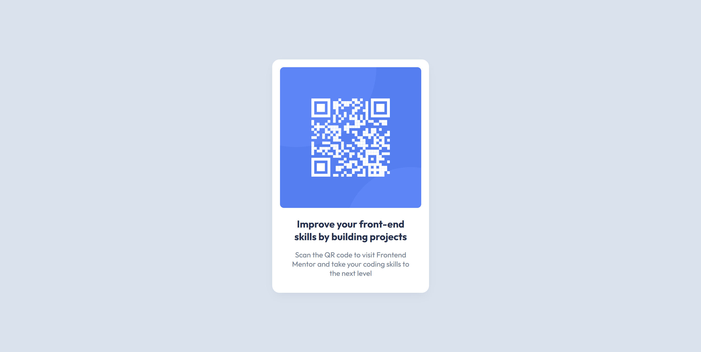

# Frontend Mentor - QR code component solution

This is a solution to the [QR code component challenge on Frontend Mentor](https://www.frontendmentor.io/challenges/qr-code-component-iux_sIO_H). Frontend Mentor challenges help you improve your coding skills by building realistic projects. 

## Table of contents

- [Overview](#overview)
  - [Screenshot](#screenshot)
  - [Links](#links)
- [My process](#my-process)
  - [Built with](#built-with)
  - [What I learned](#what-i-learned)
  - [Useful resources](#useful-resources)
- [Author](#author)

## Overview

### Screenshot

### Links

- Live Site URL: [GitHub Pages](https://merleezy.github.io/qr-code-component/)

## My process

### Built with

- Semantic HTML5 markup
- CSS custom properties
- Flexbox
- CSS Grid

### What I learned

I learned more about the CSS Grid layout and how different properties work together to create responsive designs. I also practicing using CSS Flexbox for centering elements and creating flexible layouts. Overall, this project helped me better understand how to structure HTML and CSS for a simple component while ensuring it is responsive and visually appealing.

### Useful resources

- [MDN](https://developer.mozilla.org/en-US/) - This helped me as a reference for CSS properties, especially when I was trying to understand how to use CSS Grid.

## Author

- Website - [Merleezy](https://www.your-site.com)
- Frontend Mentor - [@yourusername](https://www.frontendmentor.io/profile/yourusername)
- Twitter - [@merleezy_](https://www.twitter.com/merleezy_)